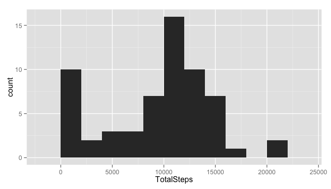

# Reproducible Research: Peer Assessment 1
It is now possible to collect a large amount of data about personal movement using activity monitoring devices such as a Fitbit, Nike Fuelband, or Jawbone Up. These type of devices are part of the “quantified self” movement – a group of enthusiasts who take measurements about themselves regularly to improve their health, to find patterns in their behavior, or because they are tech geeks. But these data remain under-utilized both because the raw data are hard to obtain and there is a lack of statistical methods and software for processing and interpreting the data.

This analysis makes use of data from a personal activity monitoring device. This device collects data at 5 minute intervals through out the day. The data consists of two months of data from an anonymous individual collected during the months of October and November, 2012 and include the number of steps taken in 5 minute intervals each day.

## Loading and preprocessing the data
First of all, load the libraries you´ll need and the data

```r
# Load libraries
library(plyr) # for ddply
library(ggplot2)
# Get data
myData <- read.csv("activity.csv")
```
## What is mean total number of steps taken per day?
Let´s plot the total steps taken every day, taken apart the missed values:

```r
dailySteps_total <- ddply(myData, "date", summarise, TotalSteps = sum(steps, na.rm = TRUE))
ggplot(dailySteps_total, aes(x = TotalSteps)) + geom_histogram(binwidth = 2000)
```

 
Be aware that this code should plot a bar graph, not a histogram os the data:

```r
# ggplot(dailySteps_total, aes(x = date, y = TotalSteps)) + geom_bar(stat = "identity")
```
Now, let`s calculate the mean and median for the total daily steps:

```r
# Calculate mean and median of the total number os steps taken per day
me1 <- mean(dailySteps_total$TotalSteps)
med1 <- median(dailySteps_total$TotalSteps)
mm1 <- c(Mean = me1, Median = med1)
mm1
```

```
##     Mean   Median 
##  9354.23 10395.00
```
## What is the average daily activity pattern?
We are interest in the dalily activity pattern, so we calculate the average number of steps in every 5-minute interval, across the 61 days, and plot the data: 

```r
# Interval means plot
intervalMean <- ddply(myData, "interval", summarise, mean = mean(steps, na.rm = TRUE))
plot(intervalMean$interval, intervalMean$Mean, type = "l", xlab = "Interval", ylab = "Steps mean", col = "blue")
```

 
The interval with the maximum number of steps, in average, is 8:35 AM (206.17 steps).

```r
# Max mean interval
maxInt_mean <- max(intervalMean$mean)
maxInt_interval <- intervalMean[which(intervalMean$mean == maxInt_mean),"interval"]
maxInterval <- c(Interval = maxInt_interval, Mean = maxInt_mean)
maxInterval
```

```
## Interval     Mean 
## 835.0000 206.1698
```
## Imputing missing values
The previous calculations didn't take into consideration the missing values (2,304 rows had no values at all): 

```r
naCheck <- is.na(myData$steps)
# Number of missing values
table(naCheck)
```

```
## naCheck
## FALSE  TRUE 
## 15264  2304
```
Now, we´ll fill in missing values with 5-minute interval mean, and repeat the previous calculations.

```r
myData_adapted <- myData
myData_adapted = transform(myData_adapted, steps = ifelse(is.na(steps), mean(myData[myData$interval == interval, "steps"], na.rm = TRUE), steps))
```
Plotting the total steps taken every day:

```r
# Plot a histogram of the total number of steps taken each day
dailySteps_total_adapted <- ddply(myData_adapted, "date", summarise, TotalSteps = sum(steps, na.rm = TRUE))
ggplot(dailySteps_total_adapted, aes(x = TotalSteps)) + geom_histogram(binwidth = 2000)
```

 
The mean and median of the total number os steps taken per day arte greater than that we get before:

```r
me2 <- mean(dailySteps_total_adapted$TotalSteps, na.rm = TRUE)
med2 <- median(dailySteps_total_adapted$TotalSteps, na.rm = TRUE)
mm2 <- c(Mean = me2, Median = med2)
mm2
```

```
##     Mean   Median 
## 10766.19 10766.19
```
## Are there differences in activity patterns between weekdays and weekends?
myData_adapted = transform(myData_adapted, dayType = ifelse(grepl("sáb|dom", weekdays(as.Date(date), abbr = TRUE)), "weekend", "weekday"))

